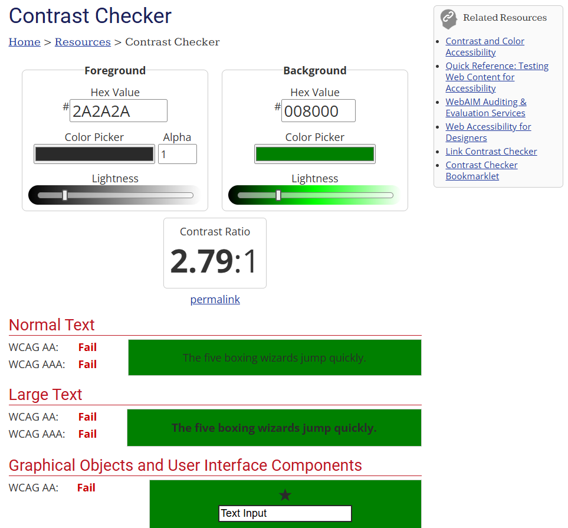

# Overview
This project is a basic web application emphasizing best practices for accessibility in web development for CS408 M5.2 Lab.

## Getting Started

To get started, clone this repository and run the following commands:

```bash
npm install
```
This will install the necessary dependencies for the project.

## Running
To run the project locally, install the Live Server extension for VScode. In the
command palette, select `Live Preview: Start Server`. Then, connect to
http://127.0.0.1:3000/ to view the running application.

## Testing
To run the tests for this project, run the following command:

```bash
npm test
```

## Accessibility Lab Answers

### Color
After running a [contrast test](https://webaim.org/resources/contrastchecker) on the original site based on the text color and background, we see that it returns poor results:


### Semantic HTML
**Keyboard Navigation**: When trying to navigate the site using the keyboard, large sections of the page's content are skipped over. This can be mitigated by adding a `tabindex="0"` attribute to headings and images to make the site more keyboard-navigable.

**Article Text**: The original site placed line breaks between text to have the appearance of paragraphs. To make the site navigable by a screen reader, paragraphs need to be marked with `<p>` tags.

**Navigation Menu**: The original site wraps the navigation bar with `<div>` with a "nav" class. To improve accessibility here, we can use `<nav>` instead of `<div>`.

### Images
To make the images screen-reader accessible, `alt` and `title` attributes can be added describing the image contents.

### Audio Player
To make the audio content more accessible, we can add a text transcript for it. For users with old browsers that don't support HTML audio, we can add a link to the
source file to ensure they still have access.

### Forms
To make the search form more accessible, we can wrap it in a `<search>` tag, and give `<input>` tags `aria-label` attributes to give them explicit labels for screen readers
without having them also show up visually. We can wrap the text labels that appear next to the `<input>` elements for the comment form with `<label>` tags, and we can link them to
their respective inputs with their id attributes.